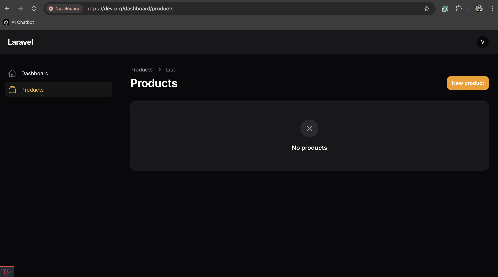
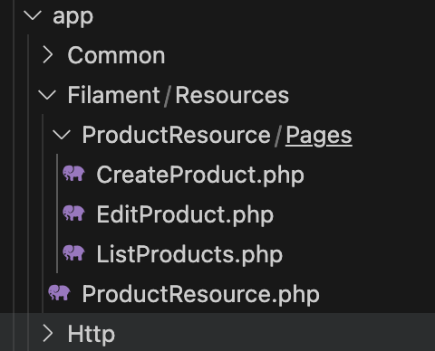
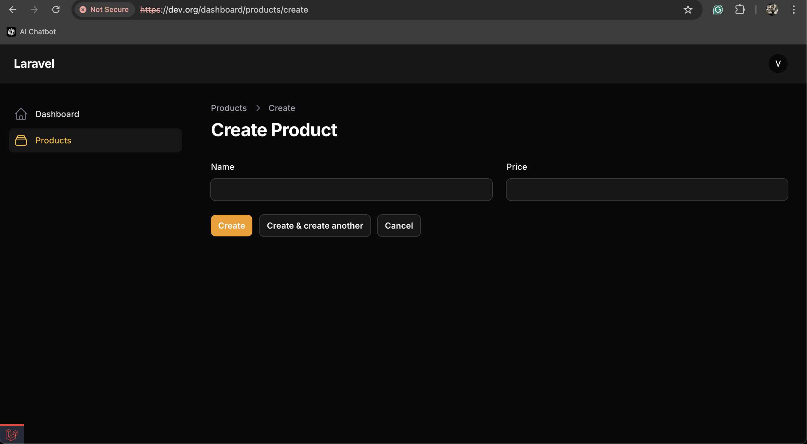
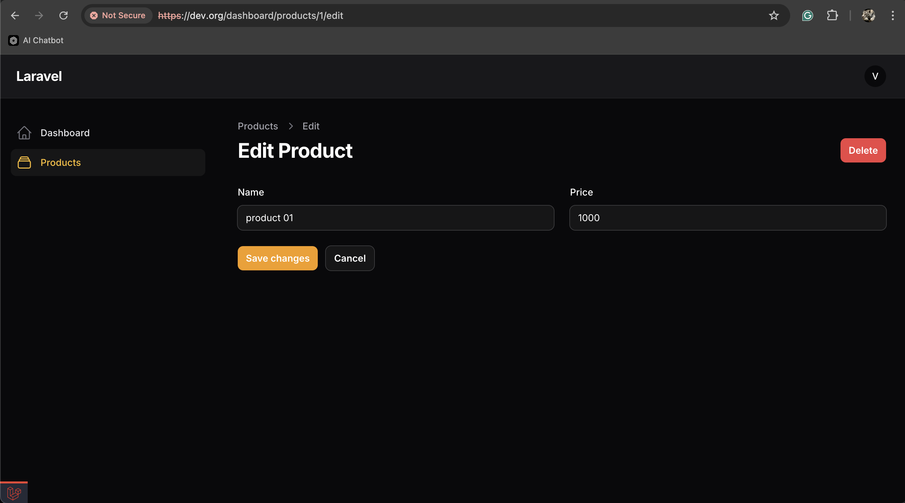
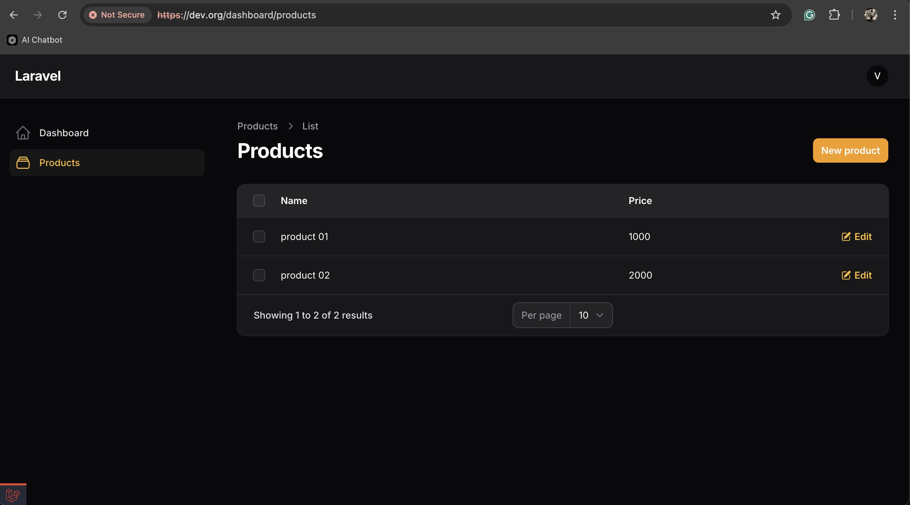
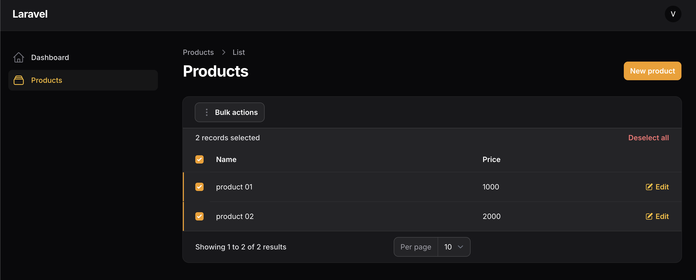

# Nginx-Laravel11 - filament

## Tạo trang Product
Tạo migration products
```cmd
php artisan make:migration create_products_table
```
```php
    public function up(): void
    {
        Schema::create('products', function (Blueprint $table) {
            $table->id();
            $table->string('name');
            $table->integer('price');
            $table->timestamps();
        });
    }
```
Tạo Model Product
```cmd
php artisan make:model Product
```
```php
class Product extends Model
{
 
    protected $fillable = [
        'name', 
        'price'
    ];
```
Triễn khai DB
```cmd
php artisan migrate
```
Tạo reource cho Product
```cmd
php artisan make:filament-resource Product
```
Thành công:


Resource của Product chứa trong: 
```cmd
app/Filament/Resources/ProductResource
```


#### Chức năng
1.  CreateProduct
2.  EditProduct
3.  ListProduct

#### Resource
-   ProductResource

### Tạo Form để nhập Product và xuất columns product ra table
```php
use Filament\Forms;
use Filament\Forms\Form;
use Filament\Resources\Resource;
use Filament\Tables;
use Filament\Tables\Table;

class ProductResource extends Resource
{

    public static function form(Form $form): Form
    {
        return $form
            ->schema([
                Forms\Components\TextInput::make('name'),
                Forms\Components\TextInput::make('price'),
            ]);
    }

    public static function table(Table $table): Table
    {
        return $table
            ->columns([
                Tables\Columns\TextColumn::make('name'), 
                Tables\Columns\TextColumn::make('price'),
            ]);
    }
```
Product form create/update


Product column on list

Product column on list bulk action


##### Đổi chuyển hướng sau khi create
```cmd
app/Filament/Resources/ProductResource/Pages/CreateProduct.php
```
```php
class CreateProduct extends CreateRecord
{
    // ...
    protected function getRedirectUrl(): string 
    { 
        return $this->getResource()::getUrl('index'); 
    } 
}
```
##### hoặc update
```cmd
app/Filament/Resources/ProductResource/Pages/EditProduct.php
```
```php
class EditProduct extends EditRecord
{
    // ...
    protected function getRedirectUrl(): string 
    { 
        return $this->getResource()::getUrl('index'); 
    } 
}
```
##### Thêm chức năng delete trên list
```php
 public static function table(Table $table): Table
    {
        return $table
            ...
            ->actions([
                Tables\Actions\EditAction::make(),
                Tables\Actions\DeleteAction::make(),
            ])
    }
```