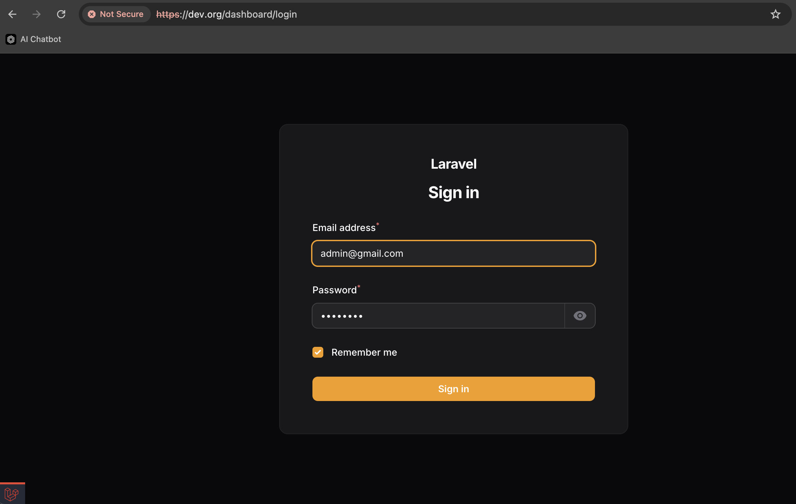
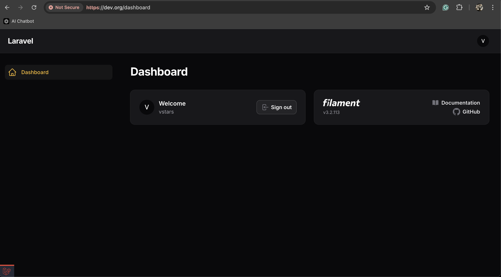

# Nginx-Laravel11 - filament

## Cài Filament
```cmd
docker exec -it Laravel11-web /bin/sh -c "composer require filament/filament"

composer require filament/filament
```

## Tài panel quản lý
```cmd
php artisan filament:install --panels
```

#### URL route mong muốn:
http://dev.org/dashboard/login
```cmd
 ┌ What is the ID? ─────────────────────────────────────────────┐
 │ dashboard                                                    │
 └──────────────────────────────────────────────────────────────┘
```
Mặc định là admin



## Tạo user
```cmd
php artisan make:filament-user

 ┌ Name ────────────────────────────────────────────────────────┐
 │ vstars                                                       │
 └──────────────────────────────────────────────────────────────┘

 ┌ Email address ───────────────────────────────────────────────┐
 │ admin@gmail.com                                              │
 └──────────────────────────────────────────────────────────────┘

 ┌ Password ────────────────────────────────────────────────────┐
 │ ••••••••                                                     │
 └──────────────────────────────────────────────────────────────┘
```

Sau khi đăng nhập xong:



Chuyển môi trường để từ hạn chế cho phép vào dashboard

```env
APP_ENV=local 
->
APP_ENV=production 
```

## Tuỳ chỉnh cho panel

app/Providers/Filament/AdminPanelProvider.php:

```php
class AdminPanelProvider extends PanelProvider
{
    public function panel(Panel $panel): Panel
    {
        return $panel
            ->default()
            ->id('dashboard')
            ->path('dashboard')
            ->login()
            ->colors([
                'primary' => Color::Amber,
            ])
            // ... more settings
            ->authMiddleware([
                Authenticate::class,
            ]);
    }
}
```

Thay đổi:
```php
return $panel
    ->path('dashboard') //đổi ở đây
    ->path('admin') 
```

Thêm chức năng:
```php
return $panel
    ->login() // thêm ở bên dưới
    ->registration() 
    ->passwordReset() 
    ->emailVerification() 
    ->profile()
```

Đổi màu:
```php
return $panel
    ->colors([
        'primary' => Color::Amber,
        'danger' => Color::Red,
        'gray' => Color::Zinc,
        'info' => Color::Blue,
        'success' => Color::Green,
        'warning' => Color::Amber,
    ])
```

## Caì dặt phân quyền:
```cmd
composer require spatie/laravel-permission

php artisan vendor:publish --provider="Spatie\Permission\PermissionServiceProvider"
```
Khai báo Provider: bootstrap\providers.php
```php
return [
    App\Providers\AppServiceProvider::class,
    ...
    Spatie\Permission\PermissionServiceProvider::class,
];
```
```mysql
INSERT INTO `roles` (`id`, `name`, `guard_name`) VALUES
(1,'admin', 'web'),
(2,'manager', 'web'),
(3,'moderator', 'web'),
(4,'supervisor', 'web'),
(5,'user', 'web');

INSERT INTO `user_roles` (`role_id`, `user_id`, `model_type`)
VALUES
    (1, 1, 'App\\Models\\User'),
    (2, 2, 'App\\Models\\User');
```

Cập nhật Models\User
```php
use Spatie\Permission\Traits\HasRoles;

class User extends Authenticatable
{
    use HasRoles; 

    public function roles()
    {
        return $this->morphToMany(
            config('permission.models.role'),
            'model',
            config('permission.table_names.model_has_roles'),
            config('permission.column_names.model_morph_key'),
            'role_id'
        );
    }

    public function getIsAdminAttribute()
    {
        return $this->hasRole([Role::ADMIN, Role::MANAGER]);
    }
```