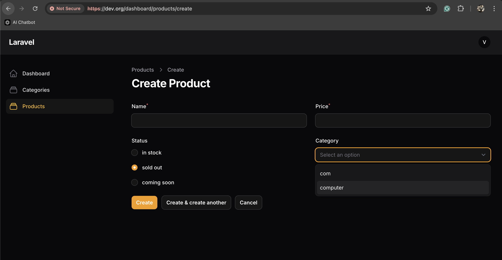
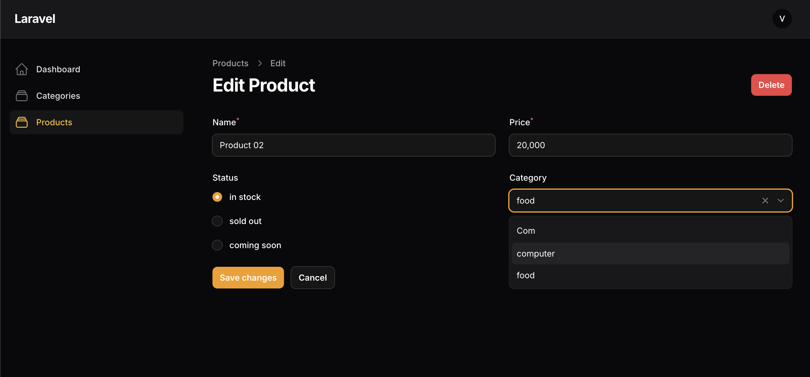

# Nginx-Laravel11 - filament

## Tạo dropmenu trong form và dropmenu với relationship
Dropmenu hardcode
```mysql
    Schema::create('products', function (Blueprint $table) {
        $table->id();
        $table->string('name');
        $table->integer('price');
        $table->enum('status',
            ['in stock', 'sold out', 'coming soon'])
            ->default('in stock');
        $table->foreignId('category_id')->nullable()->constrained(); //relationship
        $table->timestamps();
    });
```
Dropmenu với belongto
```mysql
    Schema::create('categories', function (Blueprint $table) {
        $table->id();
        $table->string('name');
        $table->timestamps();
    });
```
Tạo resource cho category
```cmd
php artisan make:filament-resource Category --simple --generate
```
Tạo relation cho Model và Tạo Model cho Category
```php
use Illuminate\Database\Eloquent\Relations\BelongsTo;
class Product extends Model
{
    use HasFactory;

    protected $fillable = [
        ...
        'status',
        'category_id' 
    ];
 
    public function category(): BelongsTo
    {
        return $this->belongsTo(Category::class);
    }
```
Thêm form và column vào resource 
```php
public static function form(Form $form): Form
    {
        return $form
            ->schema([
                ...
                Forms\Components\Radio::make('status') 
                    ->options([
                        'in stock' => 'in stock',
                        'sold out' => 'sold out',
                        'coming soon' => 'coming soon',
                    ]),
                Forms\Components\Select::make('category_id') 
                    ->relationship('category', 'name'),
                    ->searchable(), 
            ]);
    }

    public static function table(Table $table): Table
    {
        return $table
            ->columns([
                ...
                Tables\Columns\TextColumn::make('price')
                    ->sortable()
                    ->money('usd')
                    ->getStateUsing(function (Product $record): float { 
                        return $record->price / 100; 
                    })
                    ->alignEnd(), //vị trí algin
                Tables\Columns\TextColumn::make('status')
                    ->badge() //tạo badge 
                    ->color(fn (string $state): string => match ($state) {
                        // tuỳ chỉnh màu
                        'in stock' => 'primary',
                        'sold out' => 'danger',
                        'coming soon' => 'info',
                        default => 'warning'
                    }),
                Tables\Columns\TextColumn::make('category.name')
                    ->label('Category')
                    ->url(function (Product $product): string {
                        // Click để redirect link
                        return CategoryResource::getUrl('edit', [
                            'record' => $product->category_id
                        ]);
                    }), 
                Tables\Columns\TextColumn::make('created_at')
                    ->dateTime() // Sep 20, 2024 08:37:59
                    //->dateTime('m/d/Y H:i'), kiểu tuỳ chỉnh
                    //->date(), // Sep 20, 2024
                    //->since() // 5 days ago
                    ->sortable()
                    ->toggleable(isToggledHiddenByDefault: true), // bật tắt trong filter
            ])
    }
```
các vị trí align
```php
alignLeft()
alignCenter()
alignRight()
alignJustify()
alignStart()
alignEnd()

// cách khác
use Filament\Support\Enums\Alignment;
// ...
Tables\Columns\TextColumn::make('price')
    ->alignment(Alignment::End)
```

Create


Update


### Thêm product count vào category
Thêm relation vào model category
```php
class Category extends Model
{
    ...
    public function products()
    {
        return $this->hasMany(Product::class);
    }
```
Thêm column vào table
```cmd
CategoryResource.php
```

```php
public static function table(Table $table): Table
    {
        return $table
            ->columns([
                ...
                Tables\Columns\TextColumn::make('products_count')
                    ->counts('products'),
```